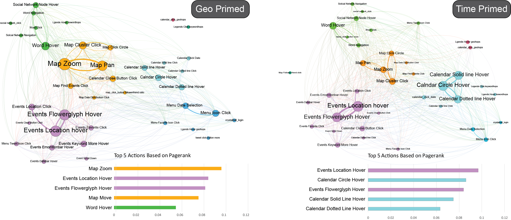

Cho, Isaac, Ryan Wesslen, Alireza Karduni, Sashank Santhanam, Samira Shaikh and Wenwen Dou (2017). [The Anchoring Effect in Decision-Making with Visual Analytics](./anchoreffect.pdf). In Visual Analytics Science and Technology (VAST), 2017 IEEE Conference.

[STM analysis of Logs RMarkdown](./STMLogAnalysis.Rmd)
[STM analysis of Logs HTML Output](https://rawgit.com/wesslen/vast2017-anchoringeffect/master/STMLogAnalysis.html)

