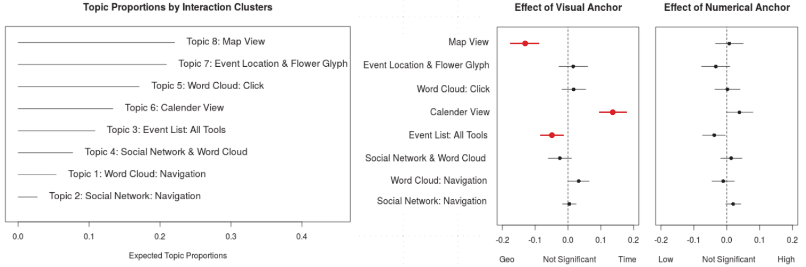

### Paper

Cho, Isaac, Ryan Wesslen, Alireza Karduni, Sashank Santhanam, Samira Shaikh and Wenwen Dou (2017). [The Anchoring Effect in Decision-Making with Visual Analytics](./anchorbias.pdf). In Visual Analytics Science and Technology (VAST), 2017 IEEE Conference.

STM analysis of Interaction Logs: [RMarkdown](./STMLogAnalysis.Rmd) / [HTML Output](https://rawgit.com/wesslen/vast2017-anchoringeffect/master/STMLogAnalysis.html)

### Abstract

Anchoring effect is the tendency to focus too heavily on one piece of information when making decisions. In this paper, we present a novel, systematic study and resulting analyses that investigate the effects of anchoring effect on human decision-making using visual analytic systems. Visual analytics interfaces typically contain multiple views that present various aspects of information such as spatial, temporal, and categorical. These views are designed to present complex, heterogeneous data in accessible forms that aid decision-making. However, human decision-making is often hindered by the use of heuristics, or cognitive biases, such as anchoring effect. Anchoring effect can be triggered by the order in which information is presented or the magnitude of information presented. Through carefully designed laboratory experiments, we present evidence of anchoring effect in analysis with visual analytics interfaces when users are primed by representation of different pieces of information. We also describe detailed analyses of users’ interaction logs which reveal the impact of anchoring bias on the visual representation preferred and paths of analysis. We discuss implications for future research to possibly detect and alleviate anchoring bias.

### Figures & Explanations

**CrystalBall, the user interface used for the study (left) and user interactions (right)**

The CrystalBall interface has 4 main views: (A) calender view, (B) map view, (C) word cloud view, and (D) social network view. The calendar view shows the future event overview (a) by default. The event list (b) is shown when the user selects a subset of future events. The tweet panel (E) is shown when the user clicks the Twitter icon.

The right figure displays main user interaction logs of the Crystalball interface. Each view has different interaction logs based on its visual elements.

**Network analysis of user interactions by Geo vs Time visual anchors**

Side by side visualization of GeoNetwork and TimeNetwork. The size of nodes is proportional to Pagerank values of nodes in each graph, the color of nodes corresponds to the detected community of each node, and the width of each edges corresponds to the weight of that edges. The bar charts show the top 5 nodes based on their Pagerank value and is color coded based the community the nodes community.

**STM Analysis of the visual and numerical anchors**

The figure on the left provides the expected topic (action-cluster) proportions with judgmental labels to aid in interpretation. The figures on the right provide the estimated effect of the visual and numerical anchors on each of the eight topics’ proportions. The dot is the point estimate and the line represents a 95 percent confidence interval. The red dots/lines are topics that are significant with 95% confidence.

**STM Analysis of temporal effects on sample interaction clusters (topics)**

This figure provides two charts on the effect between the visual anchors (line color) and time as measured by interaction deciles (x-axis) for two topics (Map View and Calendar View). Each line is the estimated topic proportions across the session and controlling for the visual anchor. The solid line is the point estimate and the dotted line is a 95 percent confidence interval. For the interaction deciles (time), we divided users’ sessions into ten evenly distributed groups. A b-spline was used to smooth the curve across the ten points.

